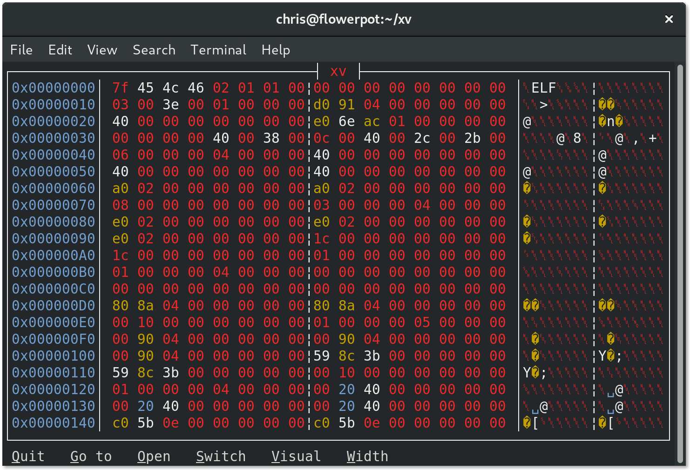

= The XV Hex Viewer

image:https://travis-ci.org/chrisvest/xv.svg?branch=master[Build status, link=https://travis-ci.org/chrisvest/xv/]
image:https://img.shields.io/badge/source-github-success.svg[Source code, link=https://github.com/chrisvest/xv/]
image:https://img.shields.io/gitter/room/chrisvest/xv.svg[Gitter chat, link=https://gitter.im/chrisvest/xv]
image:https://img.shields.io/github/license/chrisvest/xv.svg[License]

XV is a terminal hex viewer with a text user interface, written in 100% safe Rust.
Licensed under the Apache-2.0 software license.

Get it from https://crates.io/crates/xv[crates.io] by running `cargo install xv` in your terminal.
Make sure you have a proper https://github.com/chrisvest/xv/wiki[development environment] first, though.

:leveloffset: +1
include::src/help_text.md[]
